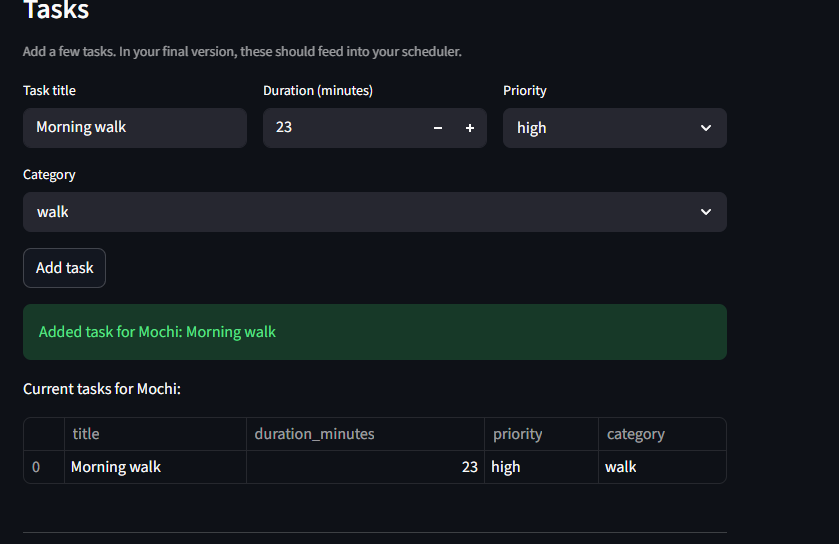
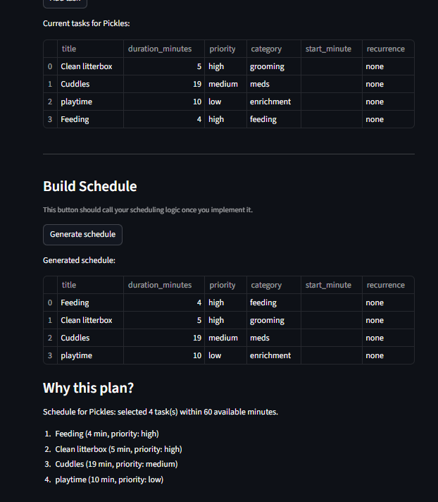
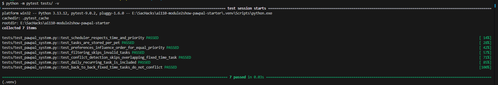

# PawPal+ (Module 2 Project)

You are building **PawPal+**, a Streamlit app that helps a pet owner plan care tasks for their pet.

## Scenario

A busy pet owner needs help staying consistent with pet care. They want an assistant that can:

- Track pet care tasks (walks, feeding, meds, enrichment, grooming, etc.)
- Consider constraints (time available, priority, owner preferences)
- Produce a daily plan and explain why it chose that plan

Your job is to design the system first (UML), then implement the logic in Python, then connect it to the Streamlit UI.

## What you will build

Your final app should:

- Let a user enter basic owner + pet info
- Let a user add/edit tasks (duration + priority at minimum)
- Generate a daily schedule/plan based on constraints and priorities
- Display the plan clearly (and ideally explain the reasoning)
- Include tests for the most important scheduling behaviors

## Getting started

### Setup

```bash
python -m venv .venv
source .venv/bin/activate  # Windows: .venv\Scripts\activate
pip install -r requirements.txt
```

### Suggested workflow

1. Read the scenario carefully and identify requirements and edge cases.
2. Draft a UML diagram (classes, attributes, methods, relationships).
3. Convert UML into Python class stubs (no logic yet).
4. Implement scheduling logic in small increments.
5. Add tests to verify key behaviors.
6. Connect your logic to the Streamlit UI in `app.py`.
7. Refine UML so it matches what you actually built.


# PawPal+ Project Reflection

## 1. System Design

- A user should be able to add a pet to their pet list
- A user should be able to create a task for a pet.
- A user user should be able to visualize all current tasks. 

**a. Initial design**

- Briefly describe your initial UML design.
The initial UML consists of 4 main candid classes: Owner which can have many Pets, who can have many Tasks associated with them. Schedule aggregates Owner + Pet to produce a task plan. 
- What classes did you include, and what responsibilities did you assign to each?
Owner, holds information about the pet owner such as name and availability, as well as pets. Pets has information about the pet such as species, name, and tasks associated. Task has title, priority, and description of what the task should do.

**b. Design changes**

- Did your design change during implementation?
No, it has not changed since creating the UML.
- If yes, describe at least one change and why you made it.
---

## 2. Scheduling Logic and Tradeoffs

**a. Constraints and priorities**

- What constraints does your scheduler consider (for example: time, priority, preferences)?
The scheduler considers preferences and time available to the Owner when it comes to creating its plans. 
- How did you decide which constraints mattered most?
I decided based on what the user would place the most value on in terms of constraining. Time is a key factor compared to preferences, as the
time they have available is influenced by many outside factors that at times can't be altered. 

**b. Tradeoffs**

- Describe one tradeoff your scheduler makes.
The scheduler prioritizes high value tasks first before preferred tasks, and only adds tasks if they fit the time.
- Why is that tradeoff reasonable for this scenario?
The trade off is reasonable since we are trying to set the schedule based on what tasks should be completed first since 
care planning needs to be quick.
---

# Tracing Add Task:
Add task was implemented and saves to the schedule.

Add task click -> Task(...) -> selected_pet.add_task(...) -> table from selected_pet.tasks


---

Algorithms picked for phase 4:

Sorting algorithm: multi-key task ordering by priority, preference match, fixed start time, then duration.
Conflict detection algorithm: interval overlap check for fixed-time tasks using start/end minute ranges.

Edge Case debugged:
I debugged an edge case where two fixed-time tasks were back-to-back, and they were marked conflicting by the scheduler. The cause was an "inclusive" overlap check plus sort ordering that could schedule 
tasks out of sequential order. I fixed it by using strict interval overlap logic and sorting fixed-time tasks by start time first.
---

## 3. AI Collaboration

**a. How you used AI**

- How did you use AI tools during this project (for example: design brainstorming, debugging, refactoring)?
I used AI tools to assist with the designing, debugging and refactoring. I analyzed the outputs each time to verify what worked and what didn't, and 
changed things manually if needed. 
- What kinds of prompts or questions were most helpful?
Questions about specific sections such as specific method implementations. 

**b. Judgment and verification**

- Describe one moment where you did not accept an AI suggestion as-is.
When the AI suggested a UML design that did not incorporate the Scheduler class as I had determined it should have been via the
requirements specifications. I clarified and ended up altering that part of the design. 
- How did you evaluate or verify what the AI suggested?
I cross-referenced with the existing requirements specifications as well as asking for analysis of WHY the logic was implemented
in the way it was, as well as falling back on my own knowledge bank. 
---

## 4. Testing and Verification

**a. What you tested**

- What behaviors did you test?
I tested the behaviors of the priority ordering, time-budget filtering, conflict detection, recurring tasks, and per-pet task isolation. 
- Why were these tests important?
These tests are important because they cover the core logic behind how tasks are scheduled and if they can be scheduled at all. The prioity ordering ensures that high value tasks are always ordered first in the list since they are marked as such do to the importance of completing them clearly. Recurring tasks ensures that tasks can be repeated or not.

**b. Confidence**

- How confident are you that your scheduler works correctly?
I am fairly confident the scheduler is working properly as testing showed it assigning tasks properly. 
- What edge cases would you test next if you had more time?
If I had more time I would have tested for cases of long tasks recurring in the same schedule, since it would need to be adjusted due to available time had by the owner.


---

Phase 5 Testing Results:

Created 7 tests to cover priority ordering, time-budget filtering, conflict detection, recurring tasks, and per-pet task isolation. One of the tests failed due to overlap (the edge case I debugged), and so
once that was fixed it passed. The tests for the priority ordering show that the high value tasks are chosen first without exceding the owners available time, fitting the constraints of the specifications. 



## 5. Reflection

**a. What went well**

- What part of this project are you most satisfied with?
I am satisfied with the in depth design assistance provided by the AI tools, and how it can pinpoint areas that can best be refactored well.

**b. What you would improve**

- If you had another iteration, what would you improve or redesign?
Improving the overall UI to match the new logic designs that have been worked on.

**c. Key takeaway**

- What is one important thing students should learn about designing systems or working with AI on this project?
Students should learn that AI can rapidly help them work through the phases of the project, but that they need to slow down and properly analyze each step, and ensure each step is being done properly by verifying and duoble checking logic.